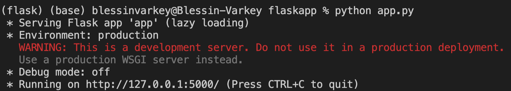

# flask-with-plotly-postgres-heroku

- Web app essentials: html, css, javascript
- Front end libraries: bootstrap, Plotly
- Front end library: Flask 
- Database: Postgres
- Cloud (Paas): Heroku

__Bootstrap:__ Most bootstrap content used for this project can be accessed [here](https://getbootstrap.com/docs/5.1/getting-started/introduction/) and [here](https://getbootstrap.com/docs/5.1/components/navbar/).

__Plotly:__ a javascript library to make data visualizations easy

```
<script src="https://cdn.plot.ly/plotly-latest.min.js"></script>
```


For error installing flask env/Flask check [here](https://stackoverflow.com/questions/31252791/flask-importerror-no-module-named-flask).




```
pip install pipenv
```

you should be able to see (projectname) on the left of the command line. Once you do, run the app file.

```
pipenv install flask plotly json
```

```
pipenv install psycopg2 (or pip install psycopg2-binary)
```

```
pipenv install flask-sqalchemy
```

```
pipenv gunicorn
```
